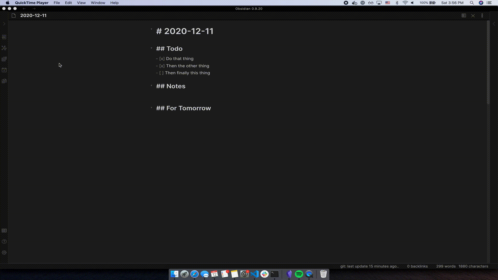

# Rollover Daily Todos

This Obsidian plugin will rollover any incomplete todo items from the previous daily note (could be yesterday, or a week ago) to today. This is triggered automatically when a new daily note is created via the internal `Daily notes` plugin, or the `Periodic Notes` plugin., It can also be run as a command from the Command Palette.



## Usage

### 1. New Daily Note

Just create a new daily note using the `Daily notes` or `Periodic Notes` plugin. The previous day's incomplete todos will be rolled over to today's daily note.

### 2. Command: Rollover Todos Now

You can also open your command palette (CMD+P on macOS) and start typing `roll` to find this command. No matter where you are in Obsidian, the previous day's todos will get rolled forward.

## Requirements

- [x] You must have either:
  1. `Daily notes` plugin installed *or*
  2. `Periodic Notes` plugin installed AND the **Daily Notes** setting toggled on
- [x] A Note folder set in one of these plugins. Inside it you must have:
  1. 2 or more notes
  2. All notes must be named in the format you use for daily notes (for example `2021-08-29` for `YYYY-MM-DD` )

## Settings

### 1. Template Heading

If you chose a template file to use for new daily notes in `Daily notes > Settings` or `Periodic Notes > Settings`, you will be able to choose a heading for incomplete notes to roll into. Note that incomplete todos are taken from the entire file, regardless of what heading they are under. And they are all rolled into today's daily note, right under the heading of choice.

If you leave this field as blank, or select `None`, then incomplete todos will be rolled onto the end of today's note (for new notes with no template, the end is the beginning of the note).

### 2. Delete todos from previous day

By default, this plugin will actually make a copy of incomplete todos. So if you forgot to wash your dog yesterday, and didn't check it off, then you will have an incomplete checkmark on yesterday's daily note, and a new incomplete checkmark will be rolled into today's daily note.

Toggling this setting on will remove incomplete todos from the previous daily note once today's daily note has a copy of them.

### 3. Remove empty todos in rollover

By default, this plugin will roll over anything that has a checkbox, whether it has content or not. Toggling this setting on will ignore empty todos. If you have **#2** from above toggled on, it will also delete empty todos.

## Bugs

- Sometimes, if you trigger the `rollover` function too quickly, it will read the state of a file before the new data was saved to disk. For example, if you add a new incomplete todo to yesterday's daily note, and then quickly run the `Rollover Todos Now` command, it may grab the state of the file a second or two before you ran the command.

For example (no template heading, empty todos toggled on):
```markdown
You type in:

- [x] Do the dishes
- [ ] Take out the trash

And then you run the Rollover Todos Now command. Today's daily note might look like:

- [ ] Take out the t

And the previous day might look like

- [x] Do the dishesrash
```

To fix this, avoid using the `Rollover Todos Now` or making new daily notes super quickly after messing with previous day's notes. Simply waiting 2-5 seconds before the rollover function is called should make this problem obsolete. I'm sure there is a solution to this, but for now, it'll just be one of the developers' todos.

## Installation

This plugin can be installed within the `Third-party Plugins` tab within Obsidian.
